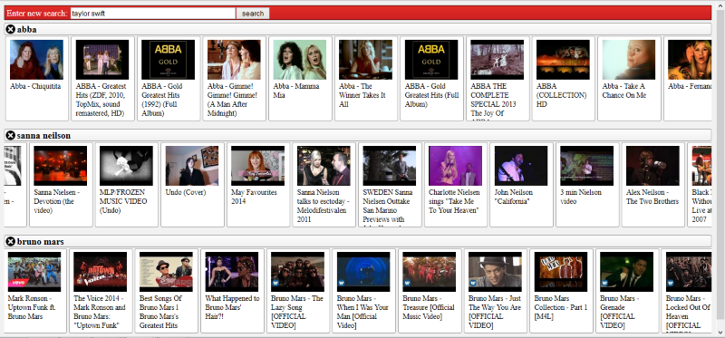

Youtube Search
========

Uses Youtube api to search for videos of any given search and displays the videos in scrollable (horizontally draggable) rows.
When you click on the videos image it displays the video in a iframe on the page, where by you can play it.

* Uses loading on demand for the images and also loads on demand the rows when you scroll down the page.
* Used webpack to allow use of commonjs modules and bundling into single js file.
* 

